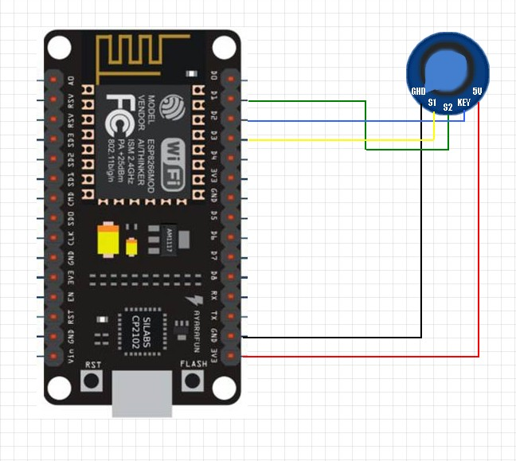

# rotary-encoder

get useful data from rotary encoder using plattformIO
http://www.buxtronix.net/2011/10/rotary-encoders-done-properly.html

turning the knob 1 step to the right gets displayed as +1.
turning the knob 1 step to the left gets displayes as -1.
pressing the knob increased the counter.

## Circuit diagram

## Example circuit in real life

